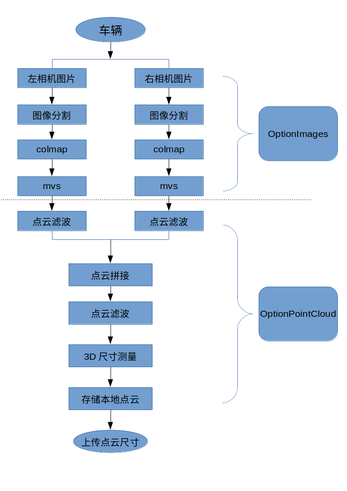

# 项目框架

## 文件目录

```bash
.
├── build
├── CMakeLists.txt
├── COPYRIGHT
├── data                                    #源文件夹
│   ├── images_src_01						#第一辆车
│   │   ├── left_src_images					#左相机源图像
│   │   │   ├── left_src_01.JPG
│   │   │   ├── left_src_02.JPG
│   │   │   └── left_src_03.JPG
│   │   └── right_src_images				#右相机源图像
│   │       ├── right_src_01.JPG
│   │       ├── right_src_02.JPG
│   │       └── right_src_03.JPG
│   └── images_src_02						#第二辆车
│       ├── left_src_images
│       └── righte_src_images
├── docs
│   ├── 流程图.odg
│   └── 流程图.png
├── include
│   ├── file.h
│   ├── optionimage.h
│   └── optionpointcloud.h
├── lib
│   └── libveh_shared_lib.so
├── README.md
├── src
│   ├── CMakeLists.txt
│   ├── file.cpp							#文件操作
│   ├── main.cpp							#主函数
│   ├── optionimage.cpp						#图片转点云
│   ├── optionpointcloud.cpp				#点云处理及测量
└── test
│   ├── CMakeLists.txt
│   └── test1.cpp
└── work									#工作文件夹
    └── images_src_01						#第一辆车
        ├── left_colmap						#left colmap输出文件夹
        ├── left_mask_images				#分割后的left 图片文件夹,也是colmap工作文件夹
        │   └── images						#图片都放入images中,按colmap格式
        ├── left_mvs						#经过mvs后输出点云数据
        ├── right_colmap
        ├── right_mask_images
        │   └── images
        └── right_mvs
```

## 框架结构



## 依赖库
sudo apt-get install \
    libboost-program-options-dev \
    libboost-filesystem-dev \
    libboost-graph-dev \
    libboost-regex-dev \
    libboost-system-dev \
    libboost-test-dev \
opencv 3.4.6

### 图像生成点云部分
1. 暂时结构顺序访问，左相机跑完后，跑右边相机
2. 暂时文件夹传递数据,如需数据存在内存，根据具体结构，将其存储位OptionImage数据成员
3. 
### 点云处理并测量部分
1. 合并处理
## 函数
### 文件及文件夹处理相关file.cpp
file.h文件中封装了和文件夹、文件相关的函数
1.检查文件夹是否存在，如不存在则创建

2.封装根据id创建文件夹

## 类
### OptionImage进行图像转点云处理过程封装
1. 暂时文件夹传递数据(由于源程序结构都是封装好的，更改接口需要时间，并且需要c++与python数据转换)
2. 
### OptionPointCloud进行点云并测量过程封装
1. PCL数据流
## 安装
安装部分还没有加入，

TODO设置头文件和库文件的放置，include和lib文件夹

## 测试